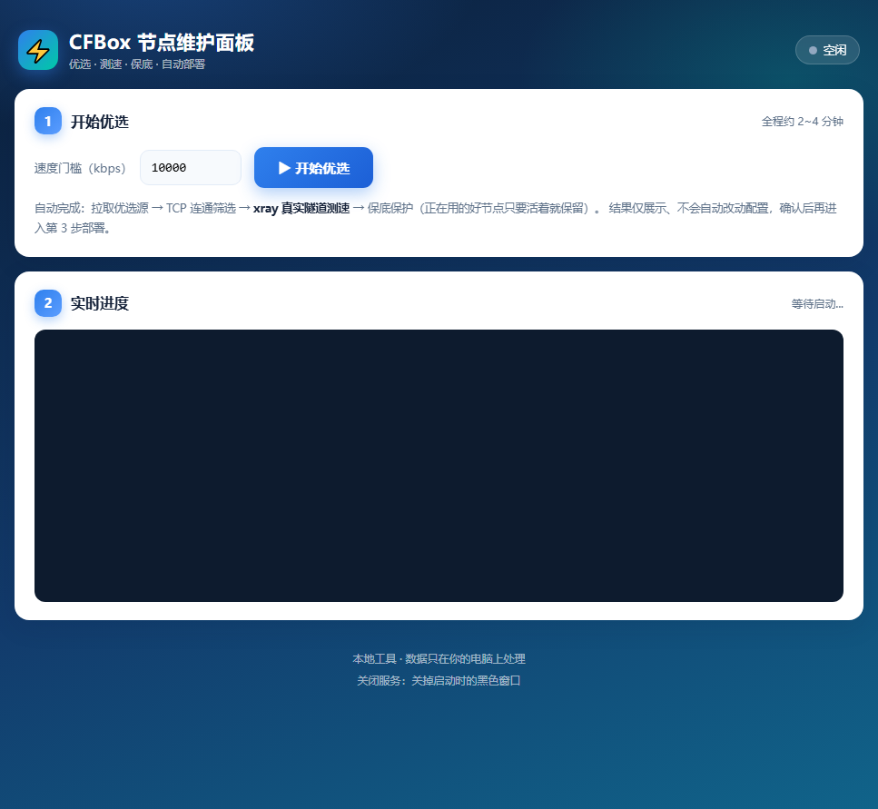

# ⚡ CFBox 节点维护面板

为 **Cloudflare Workers VLESS 订阅**（CFBox / edgetunnel）打造的自动优选与维护工具。
速度变慢？双击启动，三步恢复——自动优选、真实测速、保底保护、自动写入部署配置。



## ✨ 特性

| 能力 | 说明 |
|---|---|
| 🚀 **自动优选** | 从多个优选源拉取数百候选节点，并发 TCP 筛选 + 延迟过滤 |
| 📡 **真实测速** | xray 建立真实 VLESS+WS 隧道逐节点测速（单连接 Mbps，非猜测） |
| 🛡️ **保底保护** | 正在使用的好节点每次先测活，活着就保留，优选失败也不会变差 |
| 🤖 **自动部署** | 结果一键写入部署 KV；cfbb 管理页自动填表保存（会话侧自动完成） |
| 📱 **全终端 UI** | 响应式网页面板，手机 / 平板 / 电脑均可操作 |
| 🔒 **数据本地化** | 优选与测速全部在本地完成，不经过第三方服务器 |

## 📦 项目结构

```
cfbox-maintain/
├─ 网页版启动.bat          # 双击启动可视化面板（推荐）
├─ CFBox一键维护.bat       # 命令行模式入口
├─ webui.py                # 本地网页服务（标准库，零依赖）
├─ cfbox_maintain.py       # 核心引擎：拉源/筛选/测速/保底/更新
├─ index.html              # 本地面板 UI（响应式）
├─ site/                   # 公网展示页（Cloudflare Pages 部署根）
│   ├─ index.html
│   └─ preview.png
├─ xray_test.example.json  # 测速模板（示例，含占位符）
└─ 使用说明.txt
```

> `xray/` 测速核心与真实部署配置（UUID/域名）需按本地环境放置，不入库。

## 🚀 快速开始

1. **准备**：安装 Python 3，放置 `xray.exe` 到 `xray/` 目录（或用自有核心）
2. **配置**：编辑 `cfbox_maintain.py` 顶部配置区：
   - `QINYU` / `CFBB`：你的部署域名、UUID
   - `BASELINE_NODES`：当前在用的好节点（保底池）
   - `FETCH_SOURCES`：优选源列表
3. **启动**：双击 `网页版启动.bat` → 浏览器自动打开面板
4. **维护**：点「开始优选」→ 查看测速结果 → 「更新部署」→ 「自动上传到 cfbb」→ 刷新 Karing 订阅

### 命令行模式（备选）

```bash
python cfbox_maintain.py            # 正式：优选并自动更新
python cfbox_maintain.py --dry-run  # 预演：只看结果，不改配置
python cfbox_maintain.py --min-kbps 15000  # 自定义速度门槛
```

## ⚙️ 工作流程

```
优选源拉取 → 并发TCP筛选 → xray真实隧道测速 → 保底节点合并 → TOP8 → 写入部署KV → cfbb填表保存
```

- 测速门槛默认单连接 10 Mbps（`--min-kbps` 可调）
- 保底节点只要 TCP 存活就保留，防止优选源波动导致配置降级

## ⚠️ 说明

- 面板设计为**本地运行**（优选/测速依赖本机网络与 xray），公网页面仅作展示
- 部署信息（UUID / SNI / token）请按自己的部署环境填写，**不要**提交真实凭据到公开仓库
- 本工具仅供管理自有订阅部署使用

## 📄 License

个人使用工具，无附加约束；使用 Cloudflare / xray / CFBox 相关技术请遵守各自许可。
